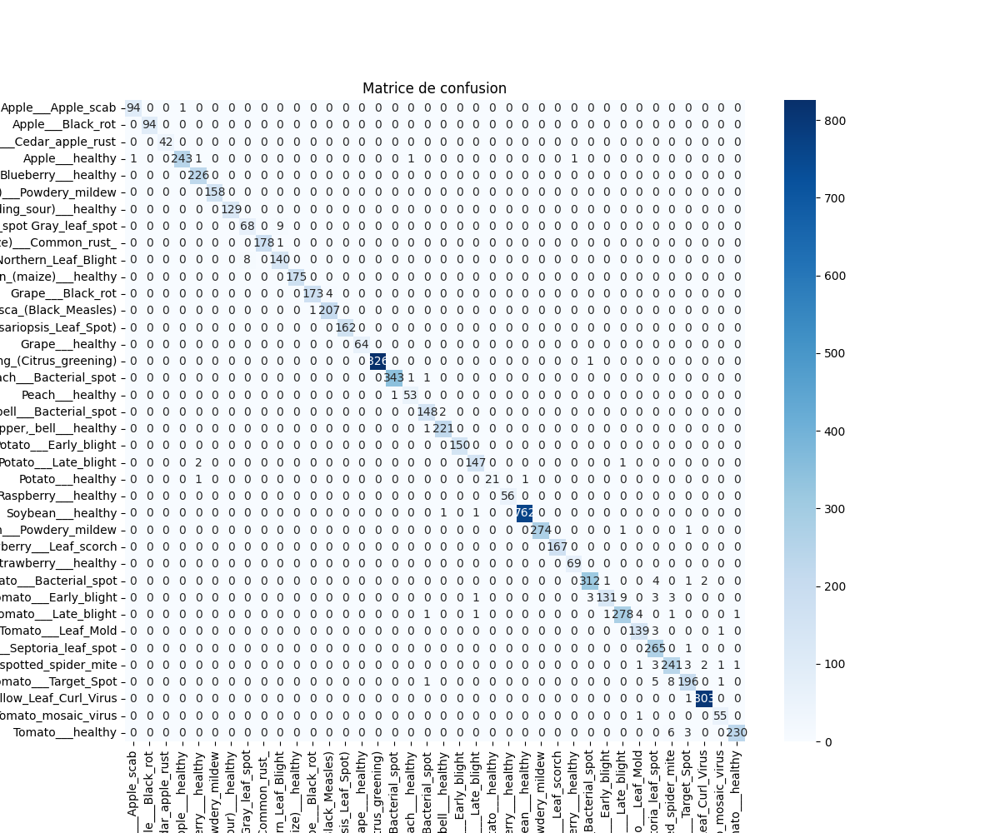
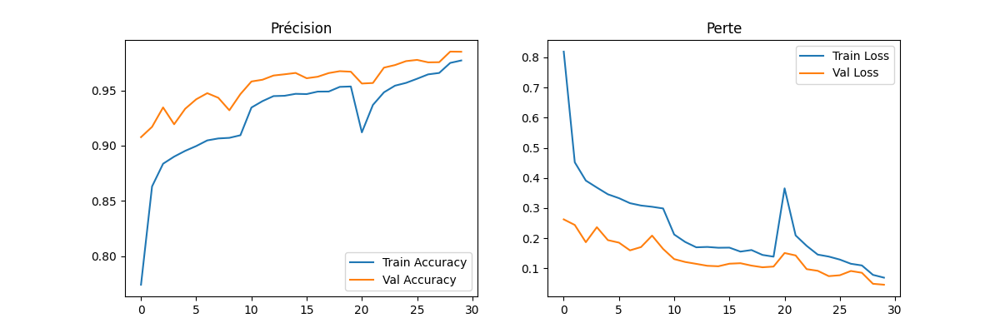

# 🌿 Plant Disease Detection using Deep Learning (CNN)

An end-to-end deep learning system for detecting plant diseases from leaf images using Convolutional Neural Networks (CNN).
This project demonstrates a complete machine learning pipeline from data preprocessing to model deployment using an interactive interface.

---
## 🚀 Live Demo

🔗 Try the model online: https://huggingface.co/spaces/fatota/plant-disease-detector

The model is deployed using Hugging Face Spaces with an interactive interface.

## 🚀 Overview

Plant diseases can significantly reduce agricultural productivity.
This project uses deep learning and computer vision to automatically classify plant diseases from leaf images.

✔ Image classification using CNN
✔ Data preprocessing & augmentation
✔ Model training & evaluation
✔ Interactive interface using Gradio

---

## 🧠 Model & Approach

* Convolutional Neural Network (CNN)
* Trained on PlantVillage dataset
* Includes preprocessing, augmentation, and evaluation

---

## 📊 Results

* Achieved good accuracy on validation dataset
* Confusion matrix and training curves available

### 📉 Confusion Matrix



### 📈 Training Curves



---

## 🖥️ Application Interface

### 📸 Interface Preview


---

## 🛠️ Tech Stack

* Python
* TensorFlow / Keras
* OpenCV
* NumPy / Pandas
* Gradio

---

## 📁 Project Structure

plant-disease-detector/

├── app.py
├── requirements.txt
├── README.md

├── notebooks/
│   └── training.ipynb

├── images/
│   ├── interface.png
│   ├── confusion_matrix.png
│   └── training_curves.png

---

## ⚙️ Installation

```bash
git clone https://github.com/Zahra-NAMAOUI/plant-disease-detector.git
cd plant-disease-detector
pip install -r requirements.txt
```

---

## ▶️ Usage

```bash
python app.py
```

Then open the Gradio interface and upload a leaf image.

---

## ⚠️ Important Note

The trained model file (.h5 or .keras) is not included due to GitHub size limitations.

---

## 🎯 Key Learnings

* Building an end-to-end ML pipeline
* Working with CNN for image classification
* Model evaluation and visualization
* Deploying ML models with Gradio

---

## 📌 Future Improvements

* Improve accuracy with advanced models
* Deploy as a web application
* Add real-time predictions

---

## 👩‍💻 Author

Fatimazahra Namaoui
AI & Data Science Engineering Student

LinkedIn: https://linkedin.com/in/fz-namaoui

---

⭐ Building intelligent systems for real-world impact
